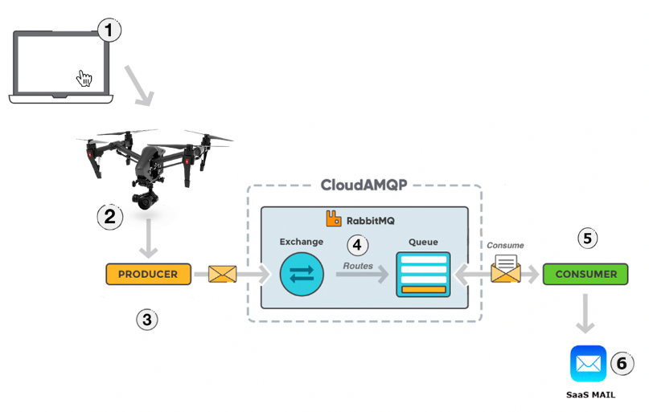

<h1 align="center">Drone Project - Integration & Development Tools </h1>

 

   <a href="#-tecnologias">Tecnologias</a>&nbsp;&nbsp;&nbsp;|&nbsp;&nbsp;&nbsp;
   <a href="#-projeto">Projeto</a>&nbsp;&nbsp;&nbsp;|&nbsp;&nbsp;&nbsp;
   <a href="#-topologia">Topologia</a>&nbsp;&nbsp;&nbsp;|&nbsp;&nbsp;&nbsp;
   <a href="#-executar">Como executar ?</a>&nbsp;&nbsp;&nbsp;|&nbsp;&nbsp;&nbsp;
 

 ## :rocket: Tecnologias

 Esse projeto foi desenvolvido utilizando Java, AMPQ, RabbitMQ e React.js

 ## 💻 Projeto

 Projeto referente a disciplina de Integration & Development Tools, do MBA da [FIAP](https://www.fiap.com.br/mba/mba-em-full-stack-developer-microservices-cloud-e-iot/). Foi desenvolvida uma solução para o agronegócio que coleta dados via sensores de temperatura e umidade. Esses sensores ficarão instalados em um drone com uma altíssima autonomia de energia, pois conta com pequenos, porém muito eficientes painéis fotovoltaicos.
 A cada 10 segundos são enviados para o message broker os dados de temperatura e umidade capturado naquele instante. Você pode ver um exemplo em vídeo do funcionamento dessas features nesse [link](https://vimeo.com/469054093 )

 ## Topologia
 

  

 ## Como executar ?

 - Baixar o projeto: `$ git clone https://github.com/DougGoncalves/Int-DevTools.git`

 - Importar o projeto na IDE de sua escolha
 - Acessar a pasta **consumer** , o arquivo **pom.xml** contém tudo o que é necessário para a importação do projeto. Acessar o package **br.com.fiap.consumer.mail** alterar o e-mail de destinatário na classe **Mail.java** (A linha para efetuar esta troca encontra-se comentada). Acessar o package **br.com.fiap.consumer.main** acesse a classe **Consumer.java** e execute.
 - Acessar a pasta **producer** , o arquivo **pom.xml** contém tudo o que é necessário para a importação do projeto. Acessar a classe **ProducerApplication.java** e execute.
 - Acessar a pasta **frontend**, realizar o import dos módulos necessários para a execução do React.js com o comando `npm install` e para rodar aplicação `npm start`, a aplicação irá abrir no browser.

 ---
<h4 align="center">
   Code and coffee ☕
</h4>

